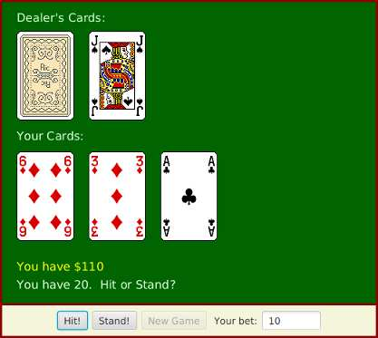

In the Blackjack game from Exercise 6.10, the user can click on the “Hit”, “Stand”, and
“NewGame” buttons even when it doesn’t make sense to do so. It would be better if
the buttons were disabled at the appropriate times. The “New Game” button should be
disabled when there is a game in progress. The “Hit” and “Stand” buttons should be
disabled when there is not a game in progress. The instance variable gameInProgress
tells whether or not a game is in progress, so you just have to make sure that the
buttons are properly enabled and disabled whenever this variable changes value. I
strongly advise writing a method that can be called every time it is necessary to set
the value of the gameInProgress variable. That method can take full responsibility for
enabling and disabling the buttons (as long as it is used consistently). Recall that if
bttn is a variable of type Button, then bttn.setDisable(true) disables the button and
bttn.setDisable(false) enables the button.
As a second (and more difficult) improvement, make it possible for the user to place bets
on the Blackjack game. When the program starts, give the user $100. Add a TextField
to the strip of controls along the bottom of the panel. The user enters the bet in this
TextField. When the game begins, check the amount of the bet. You should do this when
the game begins, not when it ends, because several errors can occur: The contents of the
TextField might not be a legal number, the bet that the user places might be more money
than the user has, or the bet might be <= 0. You should detect these errors and show an
error message instead of starting the game. The user’s bet should be an integral number
of dollars.
It would be a good idea to make the TextField uneditable while the game is in progress.
If betInput is the TextField, you can make it editable and uneditable by the user with the
commands betInput.setEditable(true) and betInput.setEditable(false).
In the drawBoard() method, you should include commands to display the amount of
money that the user has left.
There is one other thing to think about: Ideally, the program should not start a new
game when it is first created. The user should have a chance to set a bet amount before
the game starts. So, in the start() method, you should not call doNewGame(). You might
want to display a message such as “Welcome to Blackjack” before the first game starts.
Here is a picture of my program:

