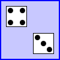

Write a program that shows a pair of dice. The dice are drawn on a Canvas. You
can assume that the size of the canvas is 100 by 100 pixels. When the user clicks
on the canvas, the dice should be rolled (that is, the dice should be assigned newly
computed random values). Each die should be drawn as a square showing from 1 to
6 dots. Since you have to draw two dice, its a good idea to write a subroutine, such as
“void drawDie(GraphicsContext g, int val, int x, int y)”, to draw a die at the
specified (x,y) coordinates. The second parameter, val, specifies the number of dots that
are showing on the die. Here is a picture of a canvas displaying two the dice:

