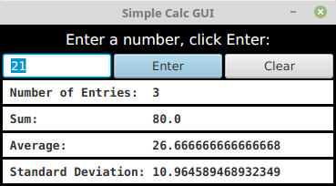

Exercise 5.2 involved a class, StatCalc.java, that could compute some statistics of a set
of numbers. Write a GUI program that uses the StatCalc class to compute and display
statistics of numbers entered by the user. The program will have an instance variable of
type StatCalc that does the computations. The program should include a TextField where
the user enters a number. It should have four labels that display four statistics for the
numbers that have been entered: the number of numbers, the sum, the mean, and the
standard deviation. Every time the user enters a new number, the statistics displayed
on the labels should change. The user enters a number by typing it into the TextField
and then either clicking an “Enter” button or pressing the Return (or Enter) key. There
should be a “Clear” button that clears out all the data. This means creating a new
StatCalc object and changing the text that is displayed on the labels. (See the discussion
of “default buttons” at the end of Subsection 6.4.2 for one way of implementing a response
the Return key.) Here is a picture of my solution to this problem:
 
Getting the interface to look just like I wanted it was the hardest part. In the end, I used
TilePanes (Subsection 6.5.4) for the layout.
