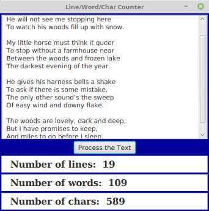

Write a program that has a TextArea where the user can enter some text. The program
should have a button such that when the user clicks on the button, the program will count
the number of lines in the user’s input, the number of words in the user’s input, and
the number of characters in the user’s input. This information should be displayed on
three Labels. Recall that if textInput is a TextArea, then you can get the contents of the
TextArea by calling the function textInput.getText(). This function returns a String
containing all the text from the text area. The number of characters is just the length
of this String. Lines in the String are separated by the new line character, ’\n’, so the
number of lines is just the number of new line characters in the String, plus one. Words
are a little harder to count. Exercise 3.4 has some advice about finding the words in a
String. Essentially, you want to count the number of characters that are first characters
in words. Here is a picture of my solution:

