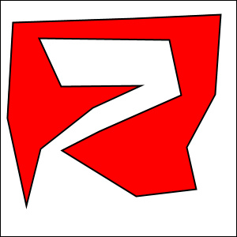

A polygon is a geometric figure made up of a sequence of connected line segments.
The points where the line segments meet are called the vertices of the polygon.
Subsection 6.2.4 has a list of shape-drawing methods in a GraphicsContext. Among them
are methods for stroking and for filling polygons: g.strokePolygon(xcoords,ycoords,n)
and g.fillPolygon(xcoords,ycoords,n), For these commands, the coordinates of the
vertices of the polygon are stored in arrays xcoords and ycoords of type double[ ], and
the number of vertices of the polygon is given by the third parameter, n. Note that it
is OK for the sides of a polygon to cross each other, but the interior of a polygon with
self-intersections might not be exactly what you expect.
Write a program that lets the user draw polygons. As the user clicks a sequence of
points in a Canvas, count the points and store their x- and y-coordinates in two arrays.
These points will be the vertices of the polygon. As the user is creating the polygon,
you should just connect all the points with line segments. When the user clicks near the
starting point, draw the complete polygon. Draw it with a red interior and a black border.
Once the user has completed a polygon, the next click should clear the data and start a
new polygon from scratch.
Here is a picture of my solution after the user has drawn a fairly complex polygon:
 
